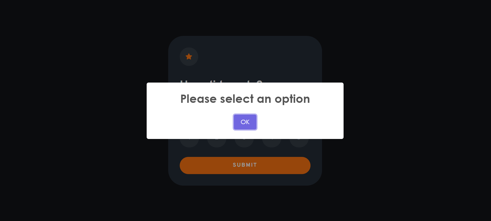

# Frontend Mentor - Interactive rating component solution

This is a solution to the [Interactive rating component challenge on Frontend Mentor](https://www.frontendmentor.io/challenges/interactive-rating-component-koxpeBUmI).

## Overview

### The challenge

Users should be able to:

- View the optimal layout for the app depending on their device's screen size
- See hover states for all interactive elements on the page
- Select and submit a number rating
- See the "Thank you" card state after submitting a rating

### Screenshot

Add a screenshot of your solution. The easiest way to do this is to use Firefox to view your project, right-click the page and select "Take a Screenshot". You can choose either a full-height screenshot or a cropped one based on how long the page is. If it's very long, it might be best to crop it.

### Links

- Solution URL: [Add solution URL here](https://your-solution-url.com)
- Live Site URL: [Add live site URL here](https://your-live-site-url.com)

## My process

### Built with

- Semantic HTML5 markup
- CSS custom properties
- Flexbox

### Useful resources

- [sweetalert](https://sweetalert2.github.io/#download) - This helped me a lot to improve the appearance of the alert. I recommend them to customize popup boxes and make the websites more beautiful. 

- Website - [Add your name here](https://www.your-site.com)
- Frontend Mentor - [@yourusername](https://www.frontendmentor.io/profile/yourusername)
- Twitter - [@yourusername](https://www.twitter.com/yourusername)
