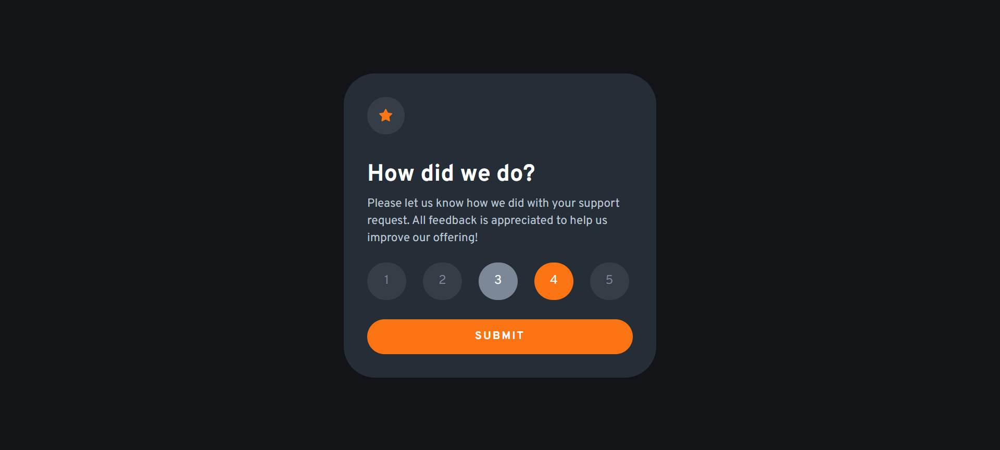
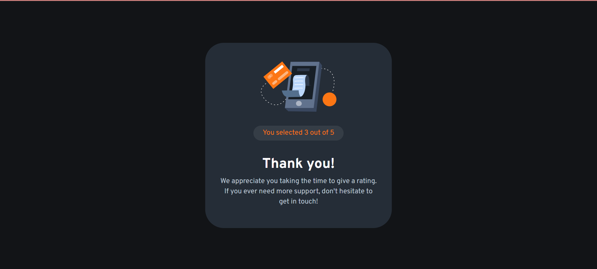
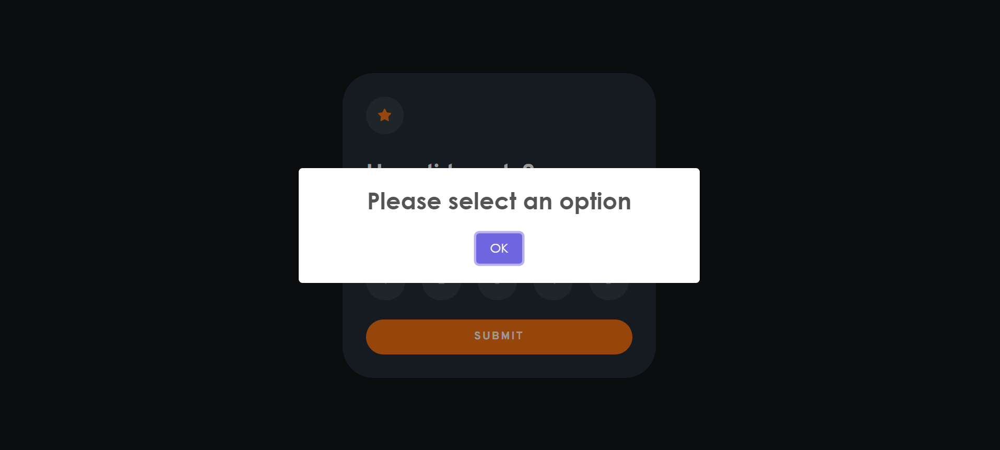

# Frontend Mentor - Interactive rating component

## Welcome! 👋

Thanks for checking out this front-end coding challenge. This is my first coding challenge with JS.

### The challenge

Users should be able to:

- View the optimal layout for the app depending on their device's screen size
- See hover states for all interactive elements on the page
- Select and submit a number rating
- See the "Thank you" card state after submitting a rating
- EXTRA: If the user doesn't choose an option, a popup will appear asking them to select.

### Screenshot

# Frontend Mentor - Interactive rating component solution

This is a solution to the [Interactive rating component challenge on Frontend Mentor](https://www.frontendmentor.io/challenges/interactive-rating-component-koxpeBUmI).

### Links

- Solution URL: [Add solution URL here](https://github.com/iEerii/InteractiveRating)
- Live Site URL: [Add live site URL here](https://interactivraiting.netlify.app/)

## My process

### Built with

- Semantic HTML5 markup
- CSS custom properties
- Flexbox
- JavaScript

### Useful resources

- [sweetalert](https://sweetalert2.github.io/#download) - This helped me a lot to improve the appearance of the alert. I recommend them to customize popup boxes and make the websites more beautiful. 

- Website - [iEerii](https://github.com/iEerii)
- Frontend Mentor - [@iEerii](https://www.frontendmentor.io/profile/iEerii)